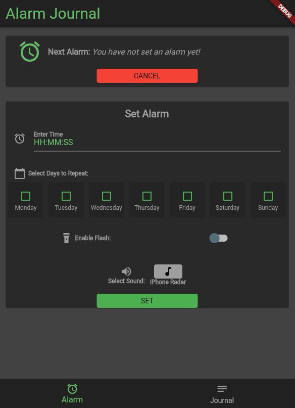
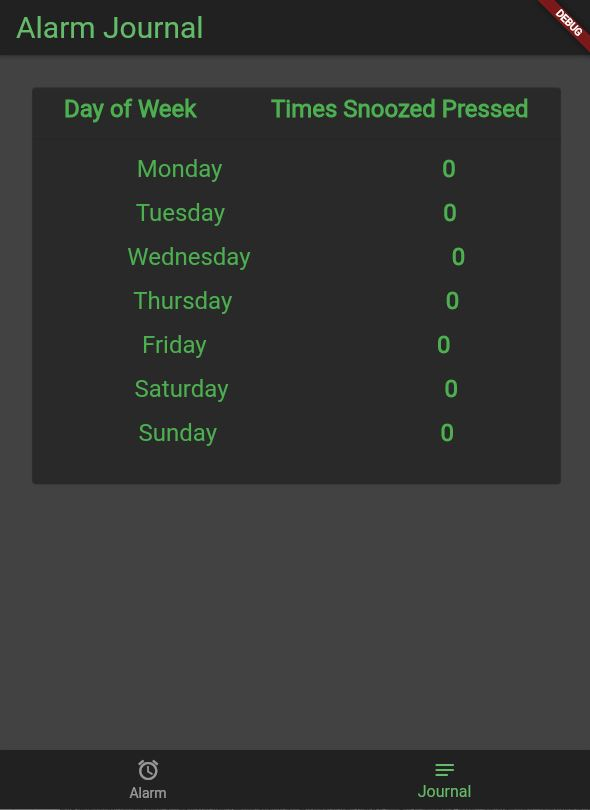

# Flutter Alarm App

## Overview

This Flutter app is designed to allow users to set alarms, customize their repeat schedule on multiple days, and keep track of the number of times the snooze button has been pressed. The app provides a user-friendly interface for setting alarms and managing alarm-related features.

## Features

- Set alarms with customizable times.
- Select which days of the week the alarm should repeat.
- Enable or disable a flashlight alert when the alarm goes off.
- Choose a sound for the alarm.
- Keep track of the number of times the snooze button is pressed.

## Screenshots

*Screenshot 1: Alarm setup screen.*

*Screenshot 2: Alarm list with repeat schedule.*

## Installation

1. Clone or download this repository to your local machine.
2. Make sure you have Flutter installed. If not, follow the [Flutter installation guide](https://flutter.dev/docs/get-started/install) for your platform.
3. Navigate to the project directory and run the following command to fetch dependencies: flutter pub get
4. Connect a physical device or set up an emulator.
5. Run the app using the following command: flutter run

## Usage
- Launch the app on your mobile device or emulator.
- Tap the "Set Alarm" button to configure a new alarm.
- Choose the time, select the days to repeat, and configure additional options.
- Save the alarm settings by tapping the "SET" button.
- The app will display your configured alarms on the main screen.
- You can enable or disable the flashlight alert, choose a sound, and view the number of snooze button presses for each alarm.
- When an alarm goes off, you can snooze it by pressing the snooze button.
- The app will keep track of the number of snooze button presses for each alarm.

## Dependencies: 
- Flutter
- intl - For date and time formatting.
- audioplayers - For playing alarm sounds.

## Licensing 
- This project is licensed under the MIT License 
